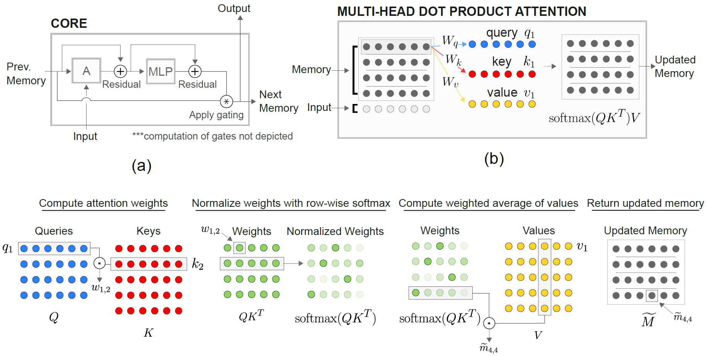
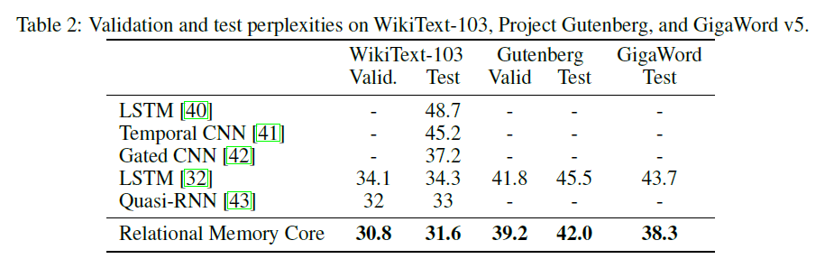
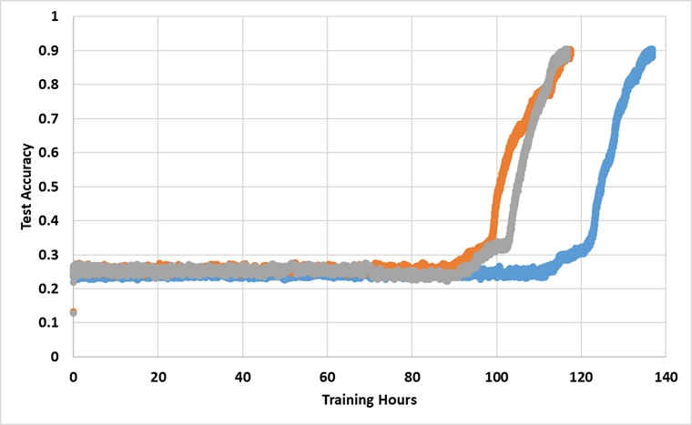

# relational-rnn-pytorch

An implementation of DeepMind's [Relational Recurrent Neural Networks](https://arxiv.org/abs/1806.01822) (Santoro et al. 2018) in PyTorch.





Relational Memory Core (RMC) module is originally from [official Sonnet implementation](https://github.com/deepmind/sonnet/blob/master/sonnet/python/modules/relational_memory.py). However, currently they do not provide a full language modeling benchmark code.

This repo is a port of RMC with additional comments. It features a full-fledged word language modeling benchmark vs. traditional LSTM.

It supports any arbitrary word token-based text dataset, including WikiText-2 & WikiText-103.

Both RMC & LSTM models support [adaptive softmax](https://pytorch.org/docs/stable/nn.html#adaptivelogsoftmaxwithloss) for much lower memory usage of large vocabulary dataset. RMC supports PyTorch's `DataParallel`, so you can easily experiment with a multi-GPU setup.

benchmark codes are hard-forked from [official PyTorch word-language-model example](https://github.com/pytorch/examples/tree/master/word_language_model)

It also features an N-th farthest synthetic task from the paper (see below).

# Requirements
PyTorch 0.4.1 or later (Tested on 1.0.0) & Python 3.6

# Examples
`python train_rmc.py --cuda ` for full training & test run of RMC with GPU.

`python train_rmc.py --cuda --adaptivesoftmax --cutoffs 1000 5000 20000` if using large vocabulary dataset (like WikiText-103) to fit all the tensors in the VRAM.

`python generate_rmc.py --cuda` for generating sentences from the trained model.

`python train_rnn.py --cuda` for full training & test run of traditional RNN with GPU.

All default hyperparameters of RMC & LSTM are results from a two-week experiment using WikiText-2.

# Data Preparation
Tested with WikiText-2 and WikiText-103. WikiText-2 is bundled.

Create a subfolder inside `./data` and place word-level `train.txt`, `valid.txt`, and `test.txt` inside the subfolder.

Specify `--data=(subfolder name)` and you are good to go.

The code performs tokenization at the first training run, and the corpus is saved as `pickle`. The code will load the `pickle` file after the first run.

# WikiText-2 Benchmark Results
Both RMC & LSTM have ~11M parameters. Please refer to the training code for details on hyperparameters.

| Models        | Valid Perplexity|Test Perplexity           | Forward pass ms/batch (TITAN Xp) |  Forward pass ms/batch (TITAN V) |
|:-------------:|:-------------:|:-------------:| :-------------:| :-------------:|
| LSTM (CuDNN)      |111.31 | 105.56 | 26~27 | 40~41 |
| LSTM (For Loop)      |Same as CuDNN | Same as CuDNN | 30~31 | 60~61 |
| RMC      | 112.77 | 107.21      |  110~130  | 220~230|

RMC can reach a comparable performance to LSTM (with heavy hyperparameter search), but it turns out that the RMC is very slow. The multi-head self-attention at every time step may be the culprit here.
Using LSTMCell with for loop (which is more "fair" benchmark for RMC) slows down the forward pass, but it's still much faster.

Please also note that the hyperparameter for RMC is a worst-case scenario in terms of speed, because it used a single memory slot (as described in the paper) and did not benefit from a row-wise weight sharing from multi-slot memory.  

Interesting to note here is that the speed is slower in TITAN V than TITAN Xp. The reason might be that the models are relatively small and the model calls small linear operations frequently.

Maybe TITAN Xp (~1,900Mhz unlocked CUDA clock speed vs. TITAN V's 1,335Mhz limit) benefits from these kind of workload. Or maybe TITAN V's CUDA kernel launch latency is higher for the ops in the model.

I'm not an expert in details of CUDA. Please share your results!  

# RMC Hyperparameter Search Results
Attention parameters tend to overfit the WikiText-2. reducing the hyperparmeters for attention (key_size) can combat the overfitting.

Applying dropout at the output logit before the softmax (like the LSTM one) helped preventing the overfitting.

|embed & head size| # heads | attention MLP layers | key size | dropout at output | memory slots | test ppl|
|:----:|:----:|:----:|:----:|:----:|:----:|:----:|
|128|	4|	3|	128|	No|	1|	128.81 |
|128|	4|	3|	128|	No|	1|	128.81 |
|128|	8|	3|	128|	No|	1|	141.84 |
|128|	4|	3|	32|	No	|1	|123.26 |
|128|	4|	3|	32|	Yes|	1|	112.4 |
|128|	4|	3|	64|	No	|1	|124.44 |
|128|	4|	3|	64|	Yes|	1|	110.16 |
|128|	4|	2|	64|	Yes|	1|	111.67 |
|64	|4	|3	|64	|Yes	|1	|133.68 |
|64	|4	|3	|32	|Yes	|1	|135.93 |
|64	|4	|3	|64	|Yes	|4	|137.93 |
|192|	4|	3|	64|	Yes|	1|	**107.21** |
|192|	4|	3|	64|	Yes|	4|	114.85 |
|256|	4|	3|	256|	No|	1|	194.73 |
|256|	4|	3|	64|	Yes|	1|	126.39 |


# About WikiText-103
The original RMC paper presents WikiText-103 results with a larger model & batch size (6 Tesla P100, each with 64 batch size, so a total of 384. Ouch).

Using a full softmax easily blows up the VRAM. Using `--adaptivesoftmax` is highly recommended. If using `--adaptivesoftmax`, `--cutoffs` should be properly provided. Please refer to the [original API description](https://pytorch.org/docs/stable/nn.html#adaptivelogsoftmaxwithloss)

I don't have such hardware and my resource is too limited to do the experiments. Benchmark result, or any other contributions are very welcome!

# Nth Farthest Task

The objective of the task is: Given k randomly labelled (from 1 to k) D-dimensional vectors, identify which is the Nth farthest vector from vector M. (The answer is an integer from 1 to k.)

The specific task in the paper is: given 8 labelled 16-dimensional vectors, which is the Nth farthest vector from vector M? The vectors are labelled randomly so the model has to recognise that the Mth vector is the vector labelled as M as opposed to the vector in the Mth position in the input. 

The input to the model comprises 8 40-dimensional vectors for each example. Each of these 40-dimensional vectors is structured like this:

```
[(vector 1) (label: which vector is it, from 1 to 8, one-hot encoded) (N, one-hot encoded) (M, one-hot encoded)] 
```

#### Example

`python train_nth_farthest.py --cuda` for training and testing on the Nth Farthest Task with GPU(s).

This uses the `RelationalMemory` class in `relational_rnn_general.py`, which is a version of `relational_rnn_models.py` without the language-modelling specific code.

Please refer to`train_nth_farthest.py` for details on hyperparameter values. These are taken from Appendix A1 in the paper and from the Sonnet implementation when the hyperparameter values are not given in the paper.

Note: new examples are generated per epoch as in the Sonnet implementation. This seems to be consistent with the paper, which does not specify the number of examples used.

#### Experiment results

The model has been trained with a single TITAN Xp GPU for forever until it reaches 91% test accuracy. Below are the results with 3 independent runs:


The model does break the 25% barrier if trained long enough, but the wall clock time is roughly over 2~3x longer than those reported in the paper.

#### TODO

Experiment with different hyperparameters 
